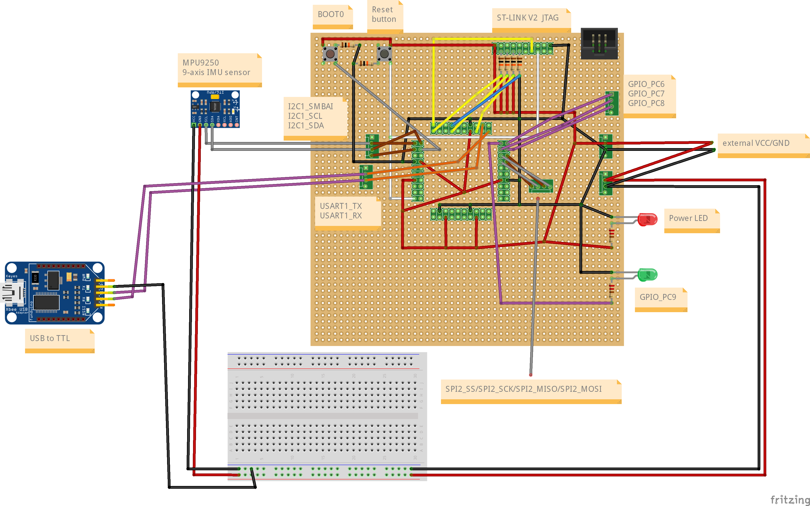
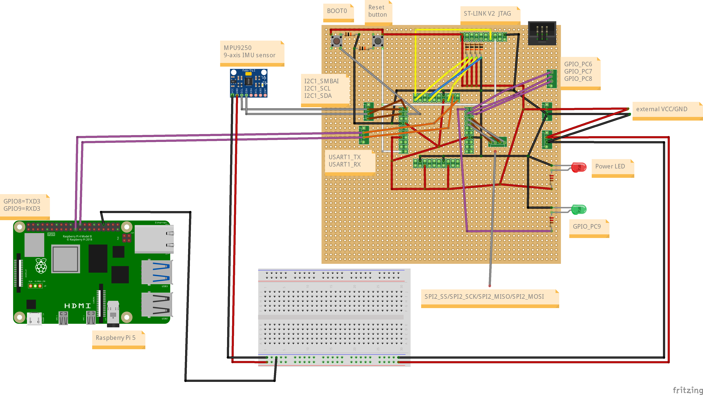
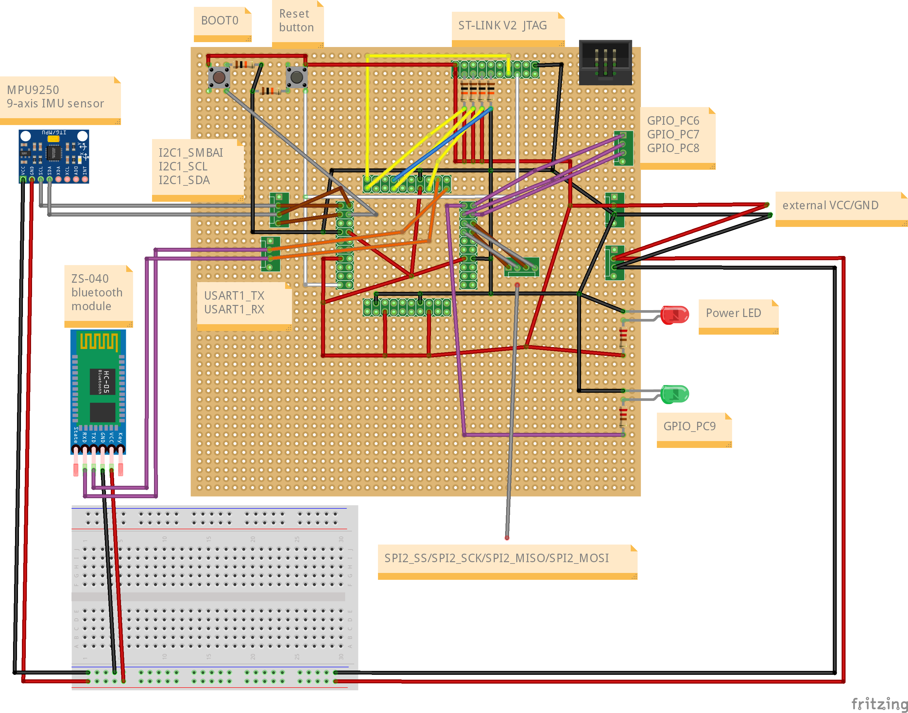

# stm32lab
stm32 practice with DIY board and stm32cubeide

# index
## toggle led
[https://youtube.com/shorts/SATOeh2hsms](https://youtube.com/shorts/SATOeh2hsms)

## serial communication
[https://youtube.com/shorts/gdPIZWpD90g](https://youtube.com/shorts/gdPIZWpD90g)

## MPU9250_I2C
[https://youtube.com/shorts/ByiFIXqM0QU](https://youtube.com/shorts/ByiFIXqM0QU)

## raspberrypi-stm32 bluetooth
[https://youtu.be/1xDIi4AG3hc](https://youtu.be/1xDIi4AG3hc)

# pinmap
| stm32f103rbt6 pin | board | main function |
|:-----------------:|:-----:|:-------------:|
|         1         |   3   |     V_BAT     |
|         2         |   4   |               |
|         3         |   5   |               |
|         4         |   6   |               |
|         5         |   7   |               |
|         6         |   8   |               |
|         7         |   9   |      NRST     |
|         8         |   10  |               |
|         9         |   11  |               |
|         10        |   12  |               |
|         11        |   13  |               |
|         12        |   14  |      VSSA     |
|         13        |   15  |      VDDA     |
|         14        |   16  |               |
|         15        |   17  |               |
|         16        |   18  |               |
|         17        |   23  |               |
|         18        |   24  |      VSS4     |
|         19        |   25  |      VDD4     |
|         20        |   26  |               |
|         21        |   27  |               |
|         22        |   28  |               |
|         23        |   29  |               |
|         24        |   30  |               |
|         25        |   31  |               |
|         26        |   32  |               |
|         27        |   33  |               |
|         28        |   34  |     BOOT1     |
|         29        |   35  |               |
|         30        |   36  |               |
|         31        |   37  |     VSS_1     |
|         32        |   38  |     VDD_1     |
|         33        |   43  |    SPI2_SS    |
|         34        |   44  |    SPI2_SCK   |
|         35        |   45  |   SPI2_MISO   |
|         36        |   46  |   SPI2_MOSI   |
|         37        |   47  |      PC6      |
|         38        |   48  |      PC7      |
|         39        |   49  |      PC8      |
|         40        |   50  |      PC9      |
|         41        |   51  |               |
|         42        |   52  |    USART_TX   |
|         43        |   53  |    USART_RX   |
|         44        |   54  |               |
|         45        |   55  |               |
|         46        |   56  |   JTMS/SWDIO  |
|         47        |   57  |      VSS2     |
|         48        |   58  |      VDD2     |
|         49        |   63  |   JTCK/SWCLK  |
|         50        |   64  |      JTDI     |
|         51        |   65  |               |
|         52        |   66  |               |
|         53        |   67  |               |
|         54        |   68  |               |
|         55        |   69  |      JTDO     |
|         56        |   70  |     JNTRST    |
|         57        |   71  |   I2C1_SBMAI  |
|         58        |   72  |    I2C1_SCL   |
|         59        |   73  |    I2C1_SDA   |
|         60        |   74  |     BOOT0     |
|         61        |   75  |               |
|         62        |   76  |               |
|         63        |   77  |      VSS3     |
|         64        |   78  |      VDD3     |

# pin connection
## stm32 - st link v2
|  stm32 | st-link v2 (JTAG) |
|:------:|:-----------------:|
|   VCC  |        VAPP       |
| JNTRST |        TRST       |
|   TDI  |        JTDI       |
|   TMS  |        JTMS       |
|   TCK  |        JTCK       |
|   TDO  |        JTDO       |
|   GND  |        GND        |

## stm32 - MPU9250
|   stm32  | MPU-9250 |
|:--------:|:--------:|
|    VCC   |    VCC   |
|    GND   |    GND   |
| I2C1_SCL |    SCL   |
| I2C1_SDA |    SDA   |
|    GND   |    AD0   |

## stm32 - USB to TTL
|   stm32   | USB to TTL |
|:---------:|:----------:|
|    GND    |     GND    |
| USART1_TX |     RXD    |
| USART1_RX |     TXD    |

## stm32 - zs040 bluetooth module
|     stm32     | ZS-040 bluetooth module |
|:-------------:|:-----------------------:|
|      GND      |           GND           |
|   USART1_TX   |           RXD           |
|   USART1_RX   |           TXD           |
| 5v (external) |           VCC           |

## stm32 - raspberry Pi 5
|   stm32   | Raspberry Pi 5 |
|:---------:|:--------------:|
|    GND    |       GND      |
| USART1_TX |   GPIO9(RXD3)  |
| USART1_RX |   GPIO8(TXD3)  |


# schematic


## schematic with mpu 9250 sensor
### schematic with UART communication with putty

### schematic with UART communication with Raspberrypi

### schematic with bluetooth communication

## board picture


## etc
[more schematic picture...](https://github.com/minchoCoin/stm32lab/tree/main/schematic)

The schematic was created using [Fritzing](https://fritzing.org/).

# Raspberry Pi 5 serial commmunication
> **Note**
> Raspberry Pi OS should be installed on Raspberry Pi 5
## Edit /boot/firmware/config.txt
add 
```
dtoverlay=uart3
enable_uart=1
```
## check UART
After rebooting...

### check pinctrl
```
user@myraspberrypi:~ $ pinctrl
...
 8: a2    pn | hi // GPIO8 = TXD3
 9: a2    pu | hi // GPIO9 = RXD3
...
```
### check serial line
```
user@myraspberrypi:~ $ ls -l /dev/ttyAMA*
crw-rw---- 1 root dialout 204, 74 Feb 25 11:07 /dev/ttyAMA10
crw-rw---- 1 root dialout 204, 67 Feb 25 11:07 /dev/ttyAMA3
```

# reference
- [stm32f103rb datasheet](https://www.st.com/resource/en/datasheet/stm32f103rb.pdf)
- [RM0008 reference manual](https://www.keil.com/dd/docs/datashts/st/stm32f10xxx.pdf)
- [UM1075 user manual](https://www.st.com/resource/en/user_manual/dm00026748-st-link-v2-in-circuit-debugger-programmer-for-stm8-and-stm32-stmicroelectronics.pdf)