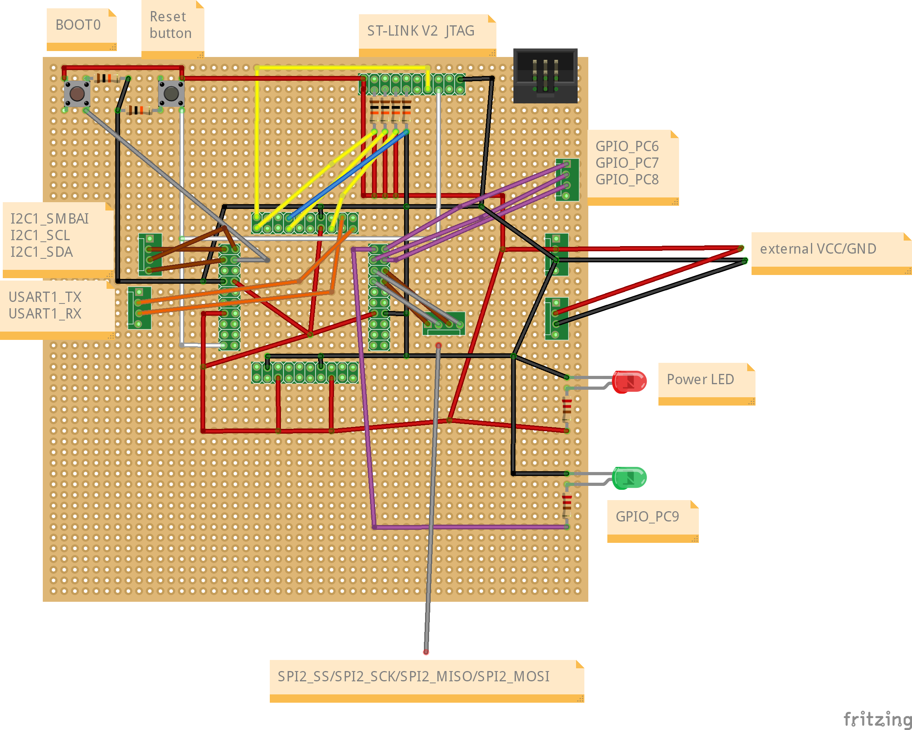

# stm32lab
stm32 practice with DIY board and stm32cubeide

# index
## toggle led
[https://youtube.com/shorts/SATOeh2hsms](https://youtube.com/shorts/SATOeh2hsms)

## serial communication
[https://youtube.com/shorts/gdPIZWpD90g](https://youtube.com/shorts/gdPIZWpD90g)

## MPU9250_I2C
[https://youtube.com/shorts/ByiFIXqM0QU](https://youtube.com/shorts/ByiFIXqM0QU)

## raspberrypi-stm32 bluetooth
[https://youtu.be/1xDIi4AG3hc](https://youtu.be/1xDIi4AG3hc)

# pinmap
| stm32f103rbt6 pin | board | main function |
|:-----------------:|:-----:|:-------------:|
|         1         |   3   |     V_BAT     |
|         2         |   4   |               |
|         3         |   5   |               |
|         4         |   6   |               |
|         5         |   7   |               |
|         6         |   8   |               |
|         7         |   9   |      NRST     |
|         8         |   10  |               |
|         9         |   11  |               |
|         10        |   12  |               |
|         11        |   13  |               |
|         12        |   14  |      VSSA     |
|         13        |   15  |      VDDA     |
|         14        |   16  |               |
|         15        |   17  |               |
|         16        |   18  |               |
|         17        |   23  |               |
|         18        |   24  |      VSS4     |
|         19        |   25  |      VDD4     |
|         20        |   26  |               |
|         21        |   27  |               |
|         22        |   28  |               |
|         23        |   29  |               |
|         24        |   30  |               |
|         25        |   31  |               |
|         26        |   32  |               |
|         27        |   33  |               |
|         28        |   34  |     BOOT1     |
|         29        |   35  |               |
|         30        |   36  |               |
|         31        |   37  |     VSS_1     |
|         32        |   38  |     VDD_1     |
|         33        |   43  |    SPI2_SS    |
|         34        |   44  |    SPI2_SCK   |
|         35        |   45  |   SPI2_MISO   |
|         36        |   46  |   SPI2_MOSI   |
|         37        |   47  |      PC6      |
|         38        |   48  |      PC7      |
|         39        |   49  |      PC8      |
|         40        |   50  |      PC9      |
|         41        |   51  |               |
|         42        |   52  |    USART_TX   |
|         43        |   53  |    USART_RX   |
|         44        |   54  |               |
|         45        |   55  |               |
|         46        |   56  |   JTMS/SWDIO  |
|         47        |   57  |      VSS2     |
|         48        |   58  |      VDD2     |
|         49        |   63  |   JTCK/SWCLK  |
|         50        |   64  |      JTDI     |
|         51        |   65  |               |
|         52        |   66  |               |
|         53        |   67  |               |
|         54        |   68  |               |
|         55        |   69  |      JTDO     |
|         56        |   70  |     JNTRST    |
|         57        |   71  |   I2C1_SBMAI  |
|         58        |   72  |    I2C1_SCL   |
|         59        |   73  |    I2C1_SDA   |
|         60        |   74  |     BOOT0     |
|         61        |   75  |               |
|         62        |   76  |               |
|         63        |   77  |      VSS3     |
|         64        |   78  |      VDD3     |

# schematic

[more schematic picture...](https://github.com/minchoCoin/stm32lab/tree/main/schematic)

The schematic was created using [Fritzing](https://fritzing.org/).

